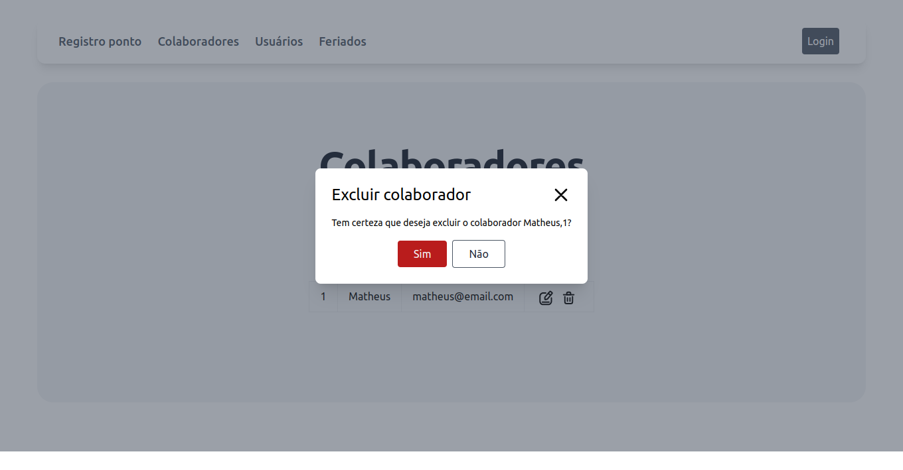

# Registro de Ponto
- Linguagem de programação PHP para o backend
- Framework Laravel no backend
- Banco de dados PostgreSQL
- Testes unitários.
- Frontend em Vue JS
- GIT para versionamento da aplicação.
- Docker para deploy da aplicação.
- Implementação UUID

# Imagens do projeto
## Tela de Registro de Ponto

## Tela de Login

## Tela com listagem de colaboradores

## Tela de inserção de colaborador

## Tela de alteração de colaborador

## Modal exclusão de colaborador

## Tela com listagem de usuários

## Tela de inserção de usuário

## Tela de alteração de usuário

## Tela com listagem de feriados

## Tela de inserção de feriado

## Tela de alteração de feriado

